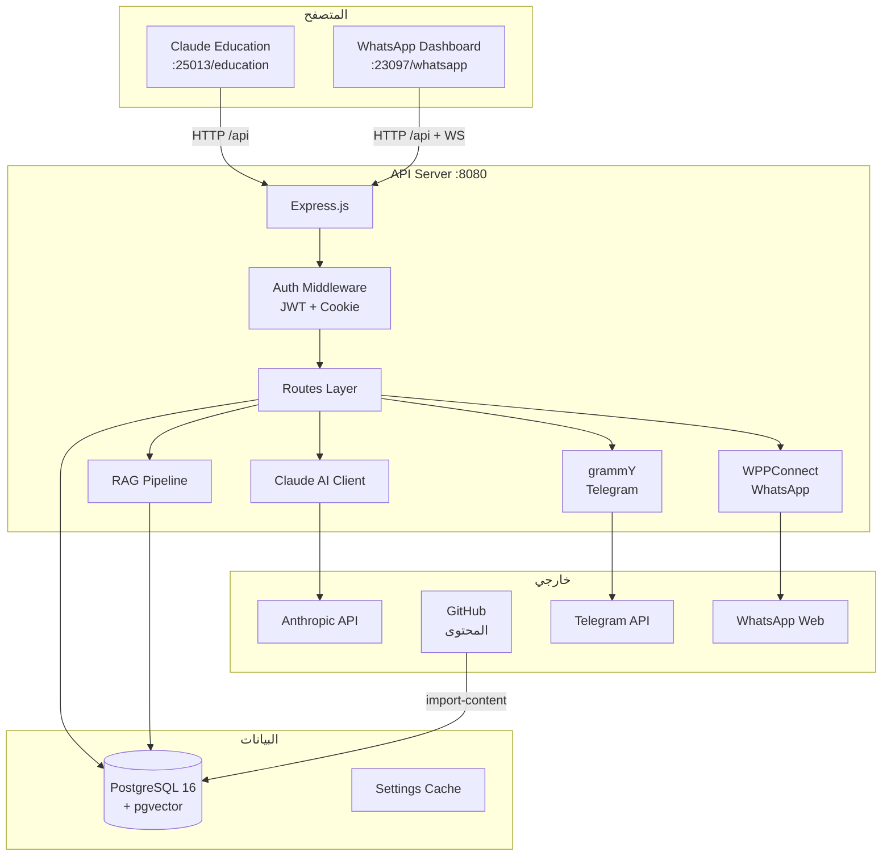
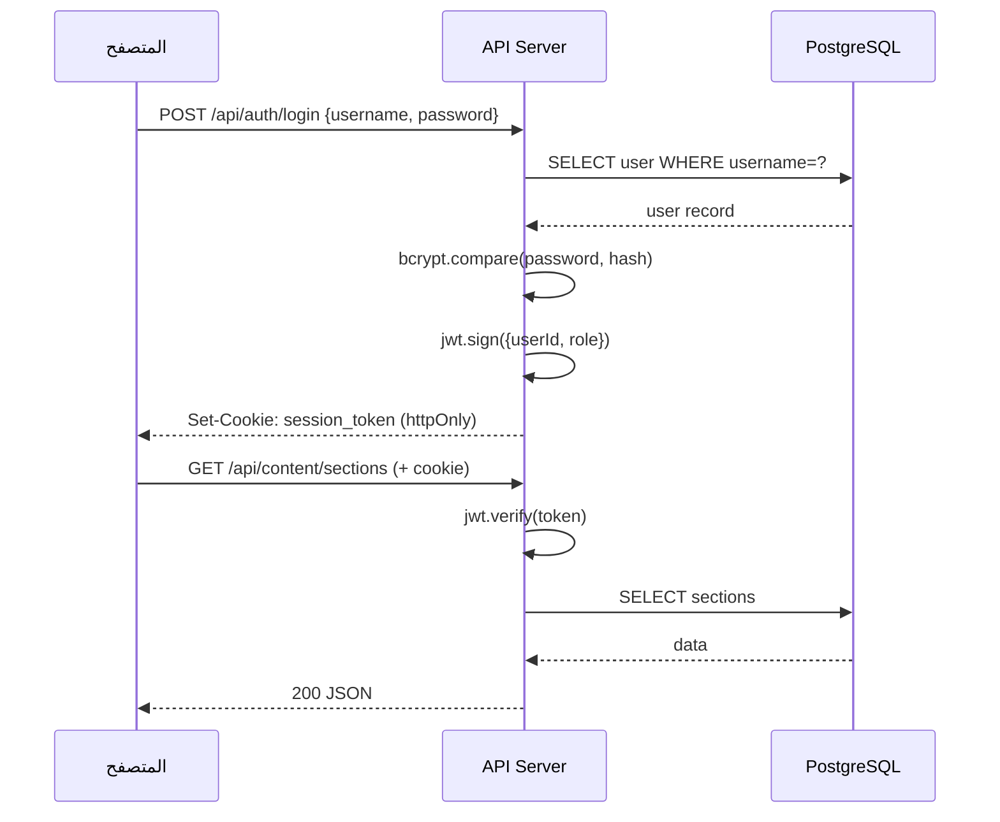
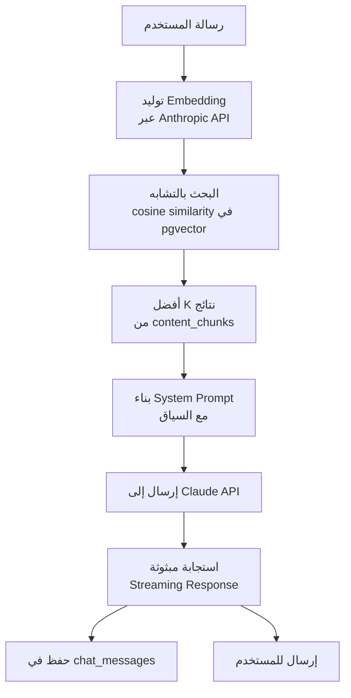
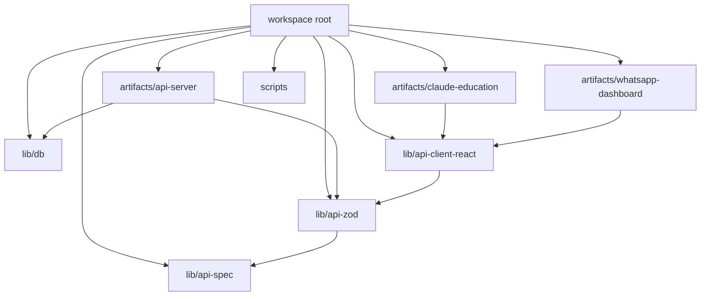

# معمارية النظام

## نوع المشروع

**تطبيق ويب متعدد الخدمات (Monorepo)** يتكون من:
- خادم API مشترك (Express.js)
- واجهتان أماميتان مستقلتان (React + Vite)
- قاعدة بيانات PostgreSQL مع pgvector للبحث الدلالي

---

## مخطط المعمارية العامة

---

## مخطط تدفق المصادقة

---

## مخطط RAG Pipeline (الدردشة الذكية)

---

## هيكل pnpm Monorepo

---

## اتخاذ القرارات التقنية

| القرار | السبب |
|-------|-------|
| pnpm workspaces | مشاركة الكود بين الحزم بدون تكرار |
| Drizzle ORM | Type-safe queries مع TypeScript |
| pgvector | بحث دلالي مدمج في قاعدة البيانات |
| esbuild | بناء سريع للخادم مع دعم ESM |
| JWT في httpOnly cookie | أمان أعلى من localStorage |
| Wouter بدلاً من React Router | حجم أصغر وبساطة أكثر |

---

## المستخدمون المستهدفون

| الشخصية | الوصف | النقاط الرئيسية |
|---------|-------|-----------------|
| **مطور عربي** | يريد تعلم Claude Code باللغة العربية | واجهة RTL، محتوى ثنائي اللغة، دردشة ذكية |
| **مدير العمليات** | يدير جلسات واتساب لفريق | لوحة تحكم، أدوار وصلاحيات، سجل تدقيق |
| **موظف المبيعات** | يرسل رسائل واتساب | واجهة مبسطة حسب الصلاحيات |
| **مستخدم تيليغرام** | يطرح أسئلة عبر بوت تيليغرام | بوت ذكي مع RAG |
