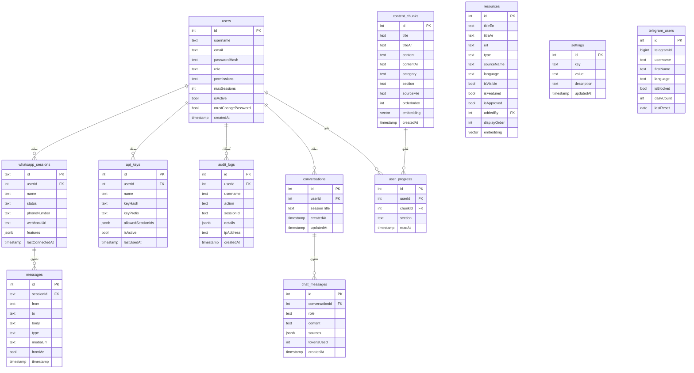

# قاعدة البيانات

**PostgreSQL 16** مع إضافة **pgvector** للبحث الدلالي.

---

## مخطط العلاقات



---

## وصف الجداول

### `users` — المستخدمون
| العمود | النوع | الوصف |
|-------|-------|-------|
| `role` | text | `admin` أو `employee` |
| `permissions` | jsonb | صلاحيات تفصيلية للموظفين |
| `maxSessions` | int | الحد الأقصى لجلسات واتساب |
| `mustChangePassword` | bool | إجبار تغيير كلمة المرور |

### `content_chunks` — محتوى التعلم
| العمود | النوع | الوصف |
|-------|-------|-------|
| `section` | text | القسم: `slash-commands`, `memory`, `mcp`, إلخ |
| `category` | text | `beginner`, `intermediate`, `advanced`, `general` |
| `embedding` | vector(1536) | تمثيل دلالي للبحث بالتشابه |
| `sourceFile` | text | المصدر من GitHub |

### `whatsapp_sessions` — جلسات واتساب
| العمود | النوع | الوصف |
|-------|-------|-------|
| `status` | text | `connected`, `disconnected`, `qr_ready`, `connecting` |
| `features` | jsonb | ميزات مفعّلة: `autoReply`, `webhookEnabled` |
| `webhookUrl` | text | رابط استقبال الرسائل الواردة |

---

## أوامر إدارة قاعدة البيانات

```bash
# رفع المخطط (تطبيق التغييرات)
pnpm --filter @workspace/db run push

# توليد migrations
pnpm --filter @workspace/db run generate

# زرع البيانات الأولية
pnpm --filter @workspace/scripts run seed

# استيراد المحتوى من GitHub
pnpm --filter @workspace/scripts run import-content

# الاتصال المباشر بقاعدة البيانات
psql $DATABASE_URL

# تفعيل pgvector (مرة واحدة)
psql $DATABASE_URL -c "CREATE EXTENSION IF NOT EXISTS vector;"
```

---

## إعدادات النظام (جدول settings)

| المفتاح | القيمة الافتراضية | الوصف |
|--------|-----------------|-------|
| `app_name` | `Claude Code Assistant` | اسم التطبيق |
| `ai_model` | `claude-3-5-sonnet-20241022` | نموذج Claude |
| `max_messages_per_day` | `50` | الحد اليومي للرسائل |
| `telegram_enabled` | `false` | تفعيل بوت تيليغرام |
| `telegram_token` | null | رمز بوت تيليغرام |
| `import_last_run` | null | آخر استيراد للمحتوى |
